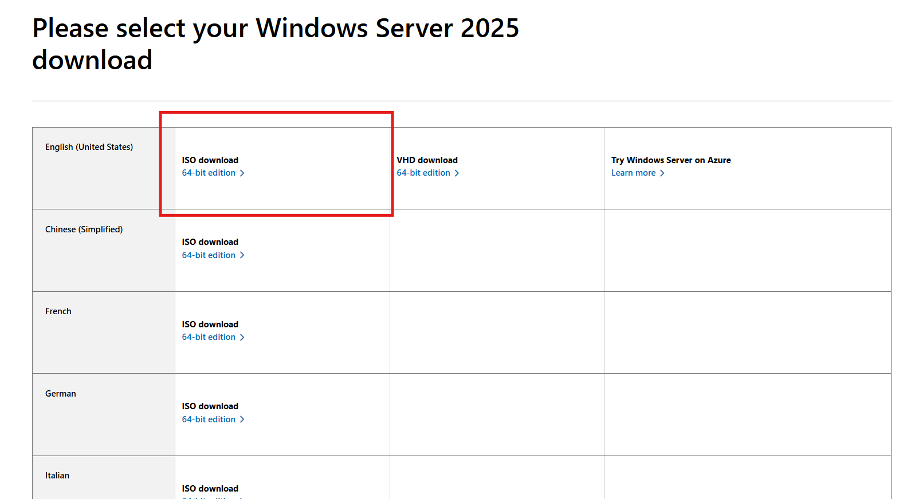

# Active Directory Setup (Domain Controller)

Trong lab này, tôi triển khai 1 Domain Controller sử dụng Windows Server để quản lý user và authentication trong môi trường doanh nghiệp mô phỏng cũng như sử dụng badBlood để populate AD với user, group, OU giả lập mục đích là tạo môi trường giống doanh nghệp thật

## Phase 1: Chuẩn bị (Preparation)
- Chuẩn bị môi trường trước khi cài AD

### Install Windows Server
Phiên bản ở đây tui sẽ sử dụng là Windows Server 2025 

- Bước 1: Tải ISO image của [Window Server](https://www.microsoft.com/en-us/evalcenter/download-windows-server-2025) trên web chính chủ. Ta chọn phiên bản theo đánh dấu trong hình

- Bước 2: Ở đây tôi sẽ sử dụng VMware để tiến hành tạo máy ảo và cài đặt Windows Server nhằm phục vụ quá trình dựng Domain Controller trong lab.

  - Đầu tiên ta bấm vào New Virtual Machine để tạo máy ảo mới.
    
    
  
  - Tiếp theo đó ta sẽ chọn Typical.
    
    

  - Chọn vào mục thứ 3.
    
    Ảnh

  - Tiếp đó để config giống như trong hình.
    
    

  - Đặt tên cho máy ảo và nơi để lưu máy ảo sau đó nhấn next.
    
    

  - Ở đây tui sẽ để là 100gb.
 
    
    
  - Ta thấy rằng nó sẽ hiện thông tin về máy ảo của ta định cài ở đây tui sẽ muốn cấu hình thêm vài thứ nữa nên chọn Customize Hardware.
    
    

  - Tôi sẽ cấu hình memory là 4.9GB và Processors là 2.
   
    

  - Ta qua mục CD/DVD (SATA). Bên phần connection ta chọn mục 2 và tiến hành browers đến file IOS Windows Server.

    

- Bước 3: Tiến hành vào máy ảo.

  - Mấy bước đầu cứ next next next :). Tại mục Select Image ta chọn phiên bản thứ 4. Sau đó nhấn next. Và sau đó accecpt các điều kiện.
    
    

  - Khi đó ta tiến hành create partition và tiến hành nhấn next để cài đặt. 
 
    

  - Sau khi cài một lúc thì nó sẽ hiện giao diện giống như hình dưới và ta sẽ cần nhập mật khẩu mà ta muốn tạo. Sau đó ấn Next.
    
    

  - Sau khi cài xong ta sẽ được giao diện giống như vậy. (Sau khi cài xong nên tạo 1 snapshot để phòng chuyện gì xảy ra)
    
    

### Static IP Configuration

Domain Controller cần IP tĩnh để đảm bảo DNS và authentication hoạt động ổn đinh. 

- Bước 1: Vào Control Panel → Network and Sharing Center
- Bước 2: Chọn Change adapter settings
- Bước 3: Chuột phải vào Ethernet → Properties
- Bước 4: Chọn IPv4 → Properties

Cấu hình:

 

### Hostname Change

Tại đây ta sẽ đổi hostname sang DC01. 

- Bước 1: Ta chuyển Local Server

- Bước 2: Tiếp đó ta ấn vào Computer Name. Và sau đó ấn vào change.

- Bước 3: Khi này tôi sẽ muốn đổi sang DC01 và nhấn okey. Máy sẽ yêu cầu ta khởi động lại để áp dụng hostname mới.

- Bước 4: Tiến hành kiểm tra lại và thấy rằng hostname đã được thay đổi.

## Phase 2: Cài đặt Domain Controller

- Bước 1: Ở màn hình chính ta chọn Add roles and features.
  

- Bước 2: Trước khi tiếp tục ta nên kiểm tra các yêu cầu dưới đây nếu đủ các yêu cầu rồi ta có thể nhấn Next để tiếp tục.
  

- Bước 3: Chọn Role-Based or feature-based installation.

- Bước 4: Tiếp đó nhấn Next.

- Bước 5: khi này ta sẽ tick vào Active Directory Domain Service. Sau đó nhấn vào Add featues. Cuối cùng là nhấn Next cho tới bước confirm luôn.

- Bước 6: Ta check cấu hình lại khi đã thấy okey ta sẽ nhấn install.

    

    

    

    

  

